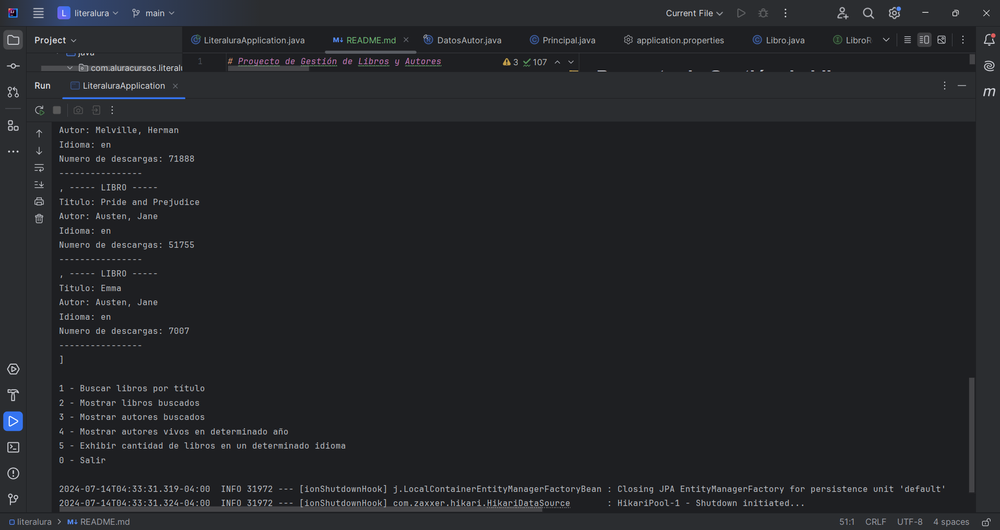

# Proyecto de Gestión de Libros y Autores




## Índice

- [Descripción del Proyecto](#descripción-del-proyecto)
- [Estado del proyecto](#estado-del-proyecto)
- [Demostración de funciones y aplicaciones](#demostración-de-funciones-y-aplicaciones)
- [Acceso al Proyecto](#acceso-al-proyecto)
- [Tecnologías utilizadas](#tecnologías-utilizadas)
- [Personas Desarrolladoras del Proyecto](#personas-desarrolladoras-del-proyecto)

## Descripción del Proyecto

Literalura es una aplicación Java basada en Spring que permite buscar libros y autores utilizando la API de Gutendex. El objetivo del proyecto es proporcionar una interfaz de consola para realizar búsquedas de libros, mostrar información sobre los libros y autores encontrados, y realizar diversas consultas como autores vivos en un determinado año y cantidad de libros en un idioma específico.

## Estado del proyecto

El proyecto está en desarrollo, con las funcionalidades básicas implementadas:

- Búsqueda de libros por título.
- Visualización de libros buscados.
- Visualización de autores buscados.
- Mostrar autores vivos en un determinado año.
- Mostrar cantidad de libros en un determinado idioma.

## Demostración de funciones y aplicaciones

A continuación, se muestra una breve demostración de las principales funcionalidades de la aplicación:

1. **Buscar libros por título**
   - Permite al usuario buscar libros ingresando un título.

2. **Mostrar libros buscados**
   - Muestra todos los libros que han sido buscados y almacenados en la base de datos.

3. **Mostrar autores buscados**
   - Muestra todos los autores que han sido buscados y almacenados en la base de datos.

4. **Mostrar autores vivos en determinado año**
   - Muestra todos los autores que estaban vivos en un año específico ingresado por el usuario.

5. **Mostrar cantidad de libros en un determinado idioma**
   - Muestra la cantidad de libros disponibles en un idioma específico ingresado por el usuario.

## Acceso al Proyecto

Puedes clonar este repositorio utilizando el siguiente enlace:

```bash
git clone https://github.com/ValeryArauco/literAlura.git
```

## Tecnologías utilizadas

- **Java**: Lenguaje de programación.
- **Spring Framework**: Framework para el desarrollo de aplicaciones Java.
- **Maven**: Herramienta de gestión y construcción de proyectos Java.
- **Gutendex API**: API para la búsqueda de libros.


## Personas Desarrolladoras del Proyecto

- **Valery Arauco** - [GitHub](https://github.com/ValeryArauco)

